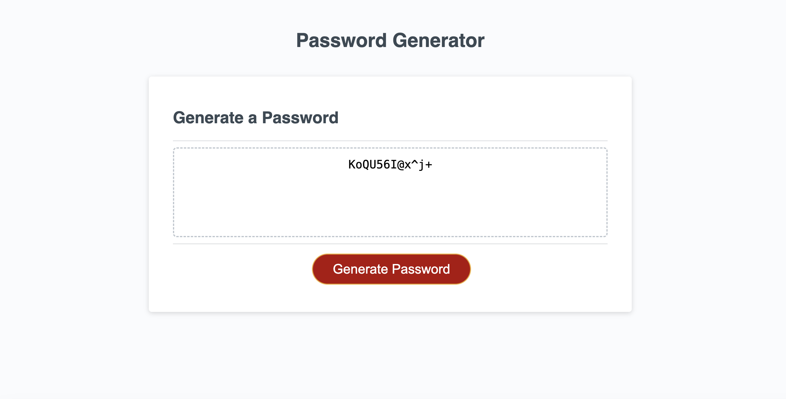

# Password Generator

## Description

Edx Bootcamp challeng to generate a random password based on criteria they’ve selected. 

* Generate a password when the button is clicked
  * Present a series of prompts for password criteria
    * Length of password
      * At least 8 characters but no more than 128.
    * Character types
      * Lowercase
      * Uppercase
      * Numeric
      * Special characters ($@%&*, etc)
  * Code should validate for each input and at least one character type should be selected
  * Once prompts are answered then the password should be generated and displayed in an alert or written to the page

## Usage
Link to deployed page****

## Credits

Help from 

Stackoverflow

https://www.w3schools.com/

## License

MIT License

Copyright (c) 2023 Vilma Hernandez

